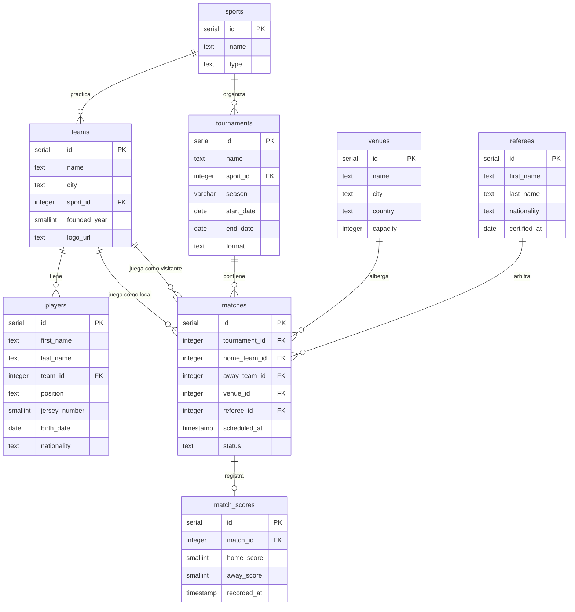

# Dominio de negocio — Sistema de Torneos Deportivos

## Descripción

Sistema de gestión de torneos deportivos que permite organizar competencias entre equipos de diferentes disciplinas. El modelo cubre desde la definición del deporte y los recintos hasta el seguimiento de partidos y sus marcadores, con una vista analítica de clasificación por torneo.

---

## Diagrama ER

---

## Entidades

### `sports`
Catálogo de deportes soportados por el sistema. `type` indica si es deporte individual o por equipos.

### `venues`
Recintos deportivos donde se juegan los partidos. Incluye ciudad, país y capacidad.

### `teams`
Equipos participantes, asociados a un deporte. El campo `founded_year` permite consultas históricas.

### `players`
Jugadores pertenecientes a un equipo. `jersey_number` tiene restricción 1–99.

### `tournaments`
Torneos organizados por deporte y temporada. `format` define la modalidad: liga, copa o fase de grupos con eliminatorias.

### `referees`
Árbitros disponibles para dirigir partidos. `certified_at` registra la fecha de certificación. Añadida en la migración `V20260806090000`.

### `matches`
Partidos entre dos equipos dentro de un torneo. `status` controla el ciclo de vida: scheduled → in_progress → finished / cancelled. Restricción: `home_team_id <> away_team_id`. La columna `referee_id` (nullable) se añadió en `V20260806090000` — un partido programado puede no tener árbitro asignado todavía.

### `match_scores`
Marcador final de un partido. Relación 1:1 con `matches` — solo existe para partidos finalizados.

---

## Vista analítica

### `vw_tournament_standings` *(migración repetible R__)*
Clasificación de equipos por torneo con puntos, victorias, empates y derrotas. Se re-aplica automáticamente cuando su definición cambia.
